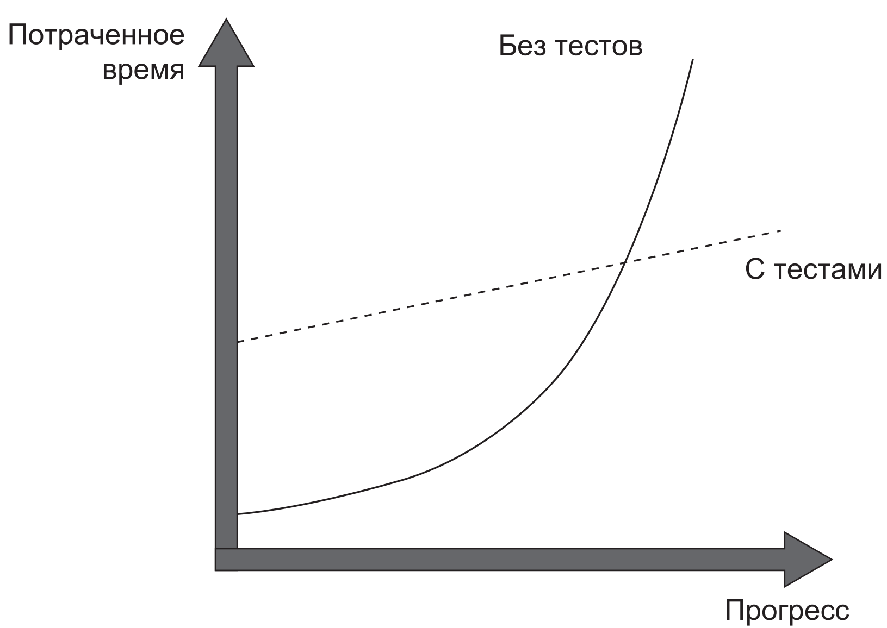

# Unit тестирование .NET приложений

## Введение
> Данное занятие основано на материалах книги Владимира Хорикова "Принципы юнит тестирования".
> Крайне полезная книга, must have к прочтению.

Для чего нам нужны автоматические тесты в принципе?

По мере роста проекта его код начинает становится всё хуже и хуже в подавляющем большинстве случаев. Изменения, вносимые
разработчиками в код, почти всегда повышают его сложность и степень беспорядочности.
Чтобы снизить степень сложности и дезорганизации системы, могут предприниматься различные попытки рефакторинга (
переписывания кода или решений в целом), чистки кода (удаления устаревших модулей целиком). Той же цели служит и
непрерывный процесс написания автоматических тестов.

Тесты позволяют программному продукту расти стабильно и снижают часть затрат на его поддержку в течении времени.

В наших проектах тесты:

- позволят проверить работоспособность и надёжность нового решения;
- снизят количество ошибок при доработке или рефакторинге старого кода;
- помогают улучшить качество кода;
- могут помочь в обучении новых разработчиков, позволяя им ознакомиться с функциональностью системы;

> Нужно понимать, что не все тесты одинаково полезны. В большинстве случаев тесты, написанные без понимания и углубления
> в предмет тестирования могут вообще не помогать в решении задач, а иногда и вовсе усложняют поддержку кодовой базы.

## Популярные фреймворки для тестирования .NET приложений

- nUnit
- xUnit
- MSTest

## Создаём проект тестов

## Метрики тестов

При разработке корпоративных приложений практически каждый solution включает некоторый набор тестов. Соотношение может
быть разным - в устаревших проектах, либо временных решениях их может быть совсем мало - буквально 1-2 тестируемых
метода, в новых - вплоть до 1:10 (на одну строчку кода приложения 10 строчек тестов).

...

## Структура unit теста

## Stub'ы и Mock'и

## Самостоятельная работа

## Литература для саморазвития

- Владимир Хориков "Принципы юнит-тестирования"
- Рой Ошероув "Искусство автономного тестирования"
